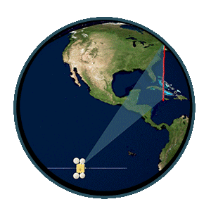

[Link to the original page of this theme](./template.md).

# Disciplinary Knowledge

This part includes some disciplinary knowledge about **Geophysics** and **Remote Sensing**. 

## Geophysics

 

Geophysics (/ˌdʒiːoʊˈfɪzɪks/) is a subject of natural science concerned with the physical processes and physical properties of the Earth and its surrounding space environment, and the use of quantitative methods for their analysis. The term geophysics sometimes refers only to solid earth applications: Earth's shape; its gravitational and magnetic fields; its internal structure and composition; its dynamics and their surface expression in plate tectonics, the generation of magmas, volcanism and rock formation. Picture is from [here](https://baike.baidu.com/item/%E5%9C%B0%E7%90%83%E7%BB%93%E6%9E%84/10631795).

However, modern geophysics organizations and pure scientists use a broader definition that includes the water cycle including snow and ice; fluid dynamics of the oceans and the atmosphere; electricity and magnetism in the ionosphere and magnetosphere and solar-terrestrial physics; and analogous problems associated with the Moon and other planets. Refering from [en.wikipedia.org](https://en.wikipedia.org/wiki/Geophysics).

Refer to my research field, I would like defined Geopthsics as fllowing (these focus on Environmental and Engineering Geophysics):

1.  Geophysics is: The subsurface site characterization of the geology, geological structure, groundwater, contamination, and human artifacts beneath the Earth's surface, based on the lateral and vertical mapping of physical property variations that are remotely sensed using non-invasive technologies. Many of these technologies are traditionally used for exploration of economic materials such as groundwater, metals, and hydrocarbons.

2.  Geophysics is: The non-invasive investigation of subsurface conditions in the Earth through measuring, analyzing and interpreting physical fields at the surface. Some studies are used to determine what is directly below the surface (the upper meter or so); other investigations extend to depths of 10's of meters or more.

Refering from [eegs.org](https://www.eegs.org/what-is-geophysics-)

### Here is my theme list:

*   Gravity and Magnetic Method   
*   Electromagnetic Method
*   Seismic Method
*   Other Methods
  
## Remote Sensing

Remote sensing (/rɪˌməʊt ˈsensɪŋ/) is the acquiring of information from a distance. NASA observes Earth and other planetary bodies via remote sensors on satellites and aircraft that detect and record reflected or emitted energy. Remote sensors, which provide a global perspective and a wealth of data about Earth systems, enable data-informed decision making based on the current and future state of our planet. Refering from [earthdata.nasa.gov](https://www.earthdata.nasa.gov/learn/backgrounders/remote-sensing). 

### Here is my theme list:

* Visible and Infrared Remote Sensing
* Thermal Infrared Remote Sensing
* Microwave Remote Sensing

# Tool Knowledge
## Machine Learning
## Finite Element Analysis
## Programming
## Literature Management and Paper Writing

# Philosophy
## Marxist philosophy
## Chinese ancient philosophy