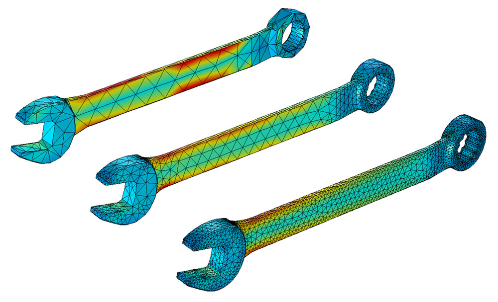

## Navigation
  
| Disciplinary Knowledge | Tool Knowledge | Philosophy |
|:-------:|:-----:|:------:|
| [Geophysics](#jump1) | [Machine Learning](#jump3) | [Marxist Philosophy](#jump1) |
| [Remote Sensing](#jump7)| [Numerical Simulation](#jump4) | [Chinese Ancient Philosophy](#jump8) | 
| | [Programming](#jump5) | |
| | [Literature Management and Paper Writing Remote Sensing](#jump6)| |
| | [Inverse Theory](#jump10) | |

# Disciplinary Knowledge

This part includes some disciplinary knowledge about **Geophysics** and **Remote Sensing**. 

##  Geophysics

 

**Geophysics** is a subject of natural science concerned with the physical processes and physical properties of the Earth and its surrounding space environment, and the use of quantitative methods for their analysis. The term geophysics sometimes refers only to solid earth applications: Earth's shape; its gravitational and magnetic fields; its internal structure and composition; its dynamics and their surface expression in plate tectonics, the generation of magmas, volcanism and rock formation. Picture is from [here](https://baike.baidu.com/item/%E5%9C%B0%E7%90%83%E7%BB%93%E6%9E%84/10631795).

However, modern geophysics organizations and pure scientists use a broader definition that includes the water cycle including snow and ice; fluid dynamics of the oceans and the atmosphere; electricity and magnetism in the ionosphere and magnetosphere and solar-terrestrial physics; and analogous problems associated with the Moon and other planets. Refering from [en.wikipedia.org](https://en.wikipedia.org/wiki/Geophysics).

Refer to my research field, I would like defined Geopthsics as following (these focus on Environmental and Engineering Geophysics):

1.  Geophysics is: The subsurface site characterization of the geology, geological structure, groundwater, contamination, and human artifacts beneath the Earth's surface, based on the lateral and vertical mapping of physical property variations that are remotely sensed using non-invasive technologies. Many of these technologies are traditionally used for exploration of economic materials such as groundwater, metals, and hydrocarbons.

2.  Geophysics is: The non-invasive investigation of subsurface conditions in the Earth through measuring, analyzing and interpreting physical fields at the surface. Some studies are used to determine what is directly below the surface (the upper meter or so); other investigations extend to depths of 10's of meters or more.

Refering from [eegs.org](https://www.eegs.org/what-is-geophysics-)

### Here is my list:

*   Gravity and Magnetic Method   
*   Electromagnetic Method
*   Seismic Method
*   Other Methods
  
##  Remote Sensing 

**Remote sensing** is the acquiring of information from a distance. NASA observes Earth and other planetary bodies via remote sensors on satellites and aircraft that detect and record reflected or emitted energy. Remote sensors, which provide a global perspective and a wealth of data about Earth systems, enable data-informed decision making based on the current and future state of our planet. Refering from [earthdata.nasa.gov](https://www.earthdata.nasa.gov/learn/backgrounders/remote-sensing). 

### Here is my list:

* Visible and Infrared Remote Sensing
* Thermal Infrared Remote Sensing
* Microwave Remote Sensing

# Tool Knowledge
The tool knowledge section is intended to serve scientific research.
##  Machine Learning 
 
Machine learning is a branch of artificial intelligence (AI) and computer science which focuses on the use of data and algorithms to imitate the way that humans learn, gradually improving its accuracy.

Since deep learning and machine learning tend to be used interchangeably, it’s worth noting the nuances between the two. Machine learning, deep learning, and neural networks are all sub-fields of artificial intelligence. However, neural networks is actually a sub-field of machine learning, and deep learning is a sub-field of neural networks. Refering from [www.ibm.com](https://www.ibm.com/cloud/learn/machine-learning)
### Here is my list:
* Supervised Learning
* Unsupervised Leanring
* Semi-supervised Leanring
* Reinforcement Leanring
##  Numerical Simulation 
 

The finite element method is a numerical technique for obtaining approximate solutions to boundary-value problems of mathematical physics. 
### Here is my list:
* Finite Difference Methods
* Finite Element Methods
* Finite Volume Methods
* Other Methods
##  Programming 

##  Literature Management and Paper Writing 

##  Inverse Theory 

# Philosophy

##  Marxist Philosophy 

##  Chinese Ancient Philosophy 

------
| [Return to Navigation](#jump9) | Contact Us : hesiyuan.work@hotmail.com  |

[Link to the original page of this theme](./template.md).
